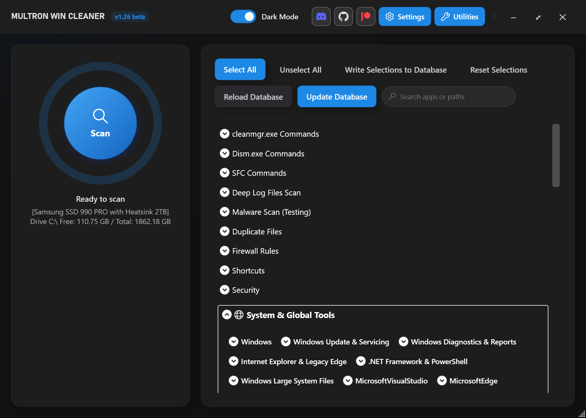
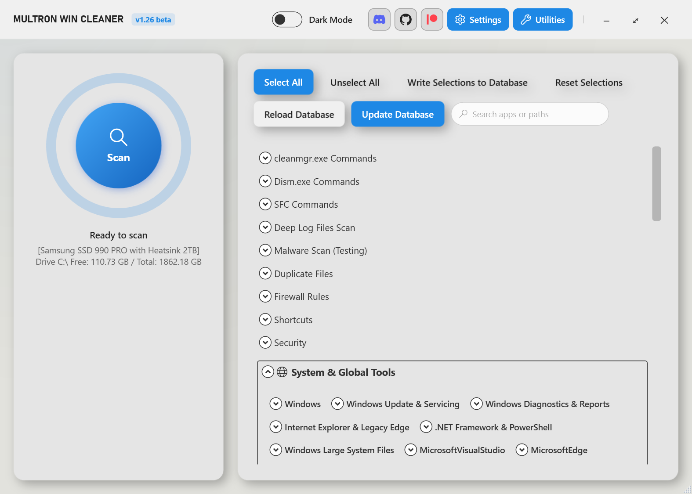
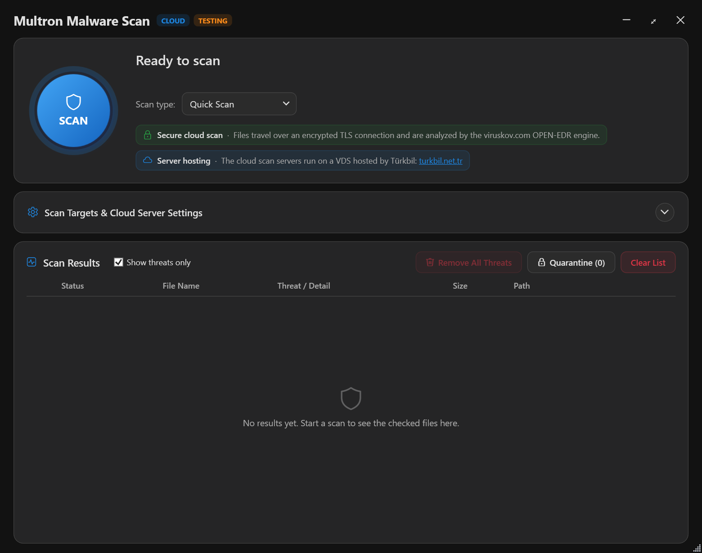
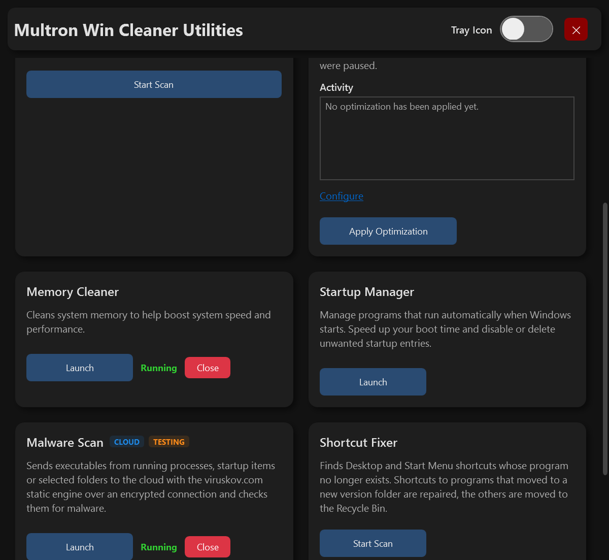
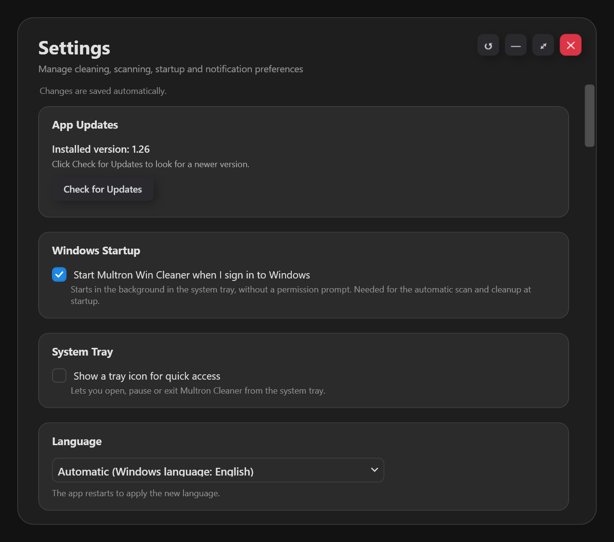
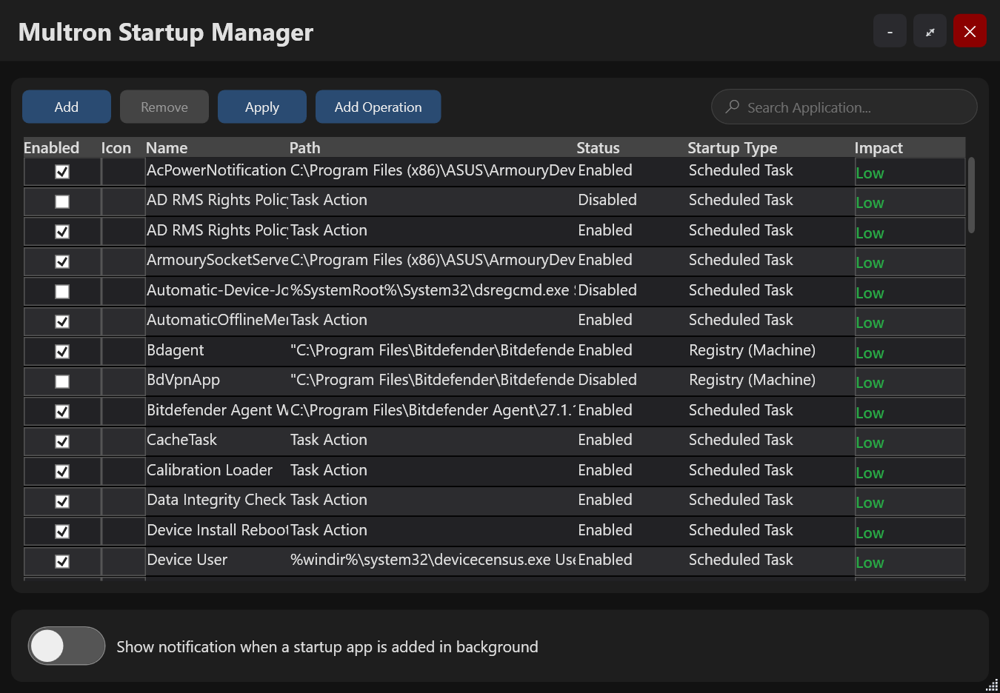
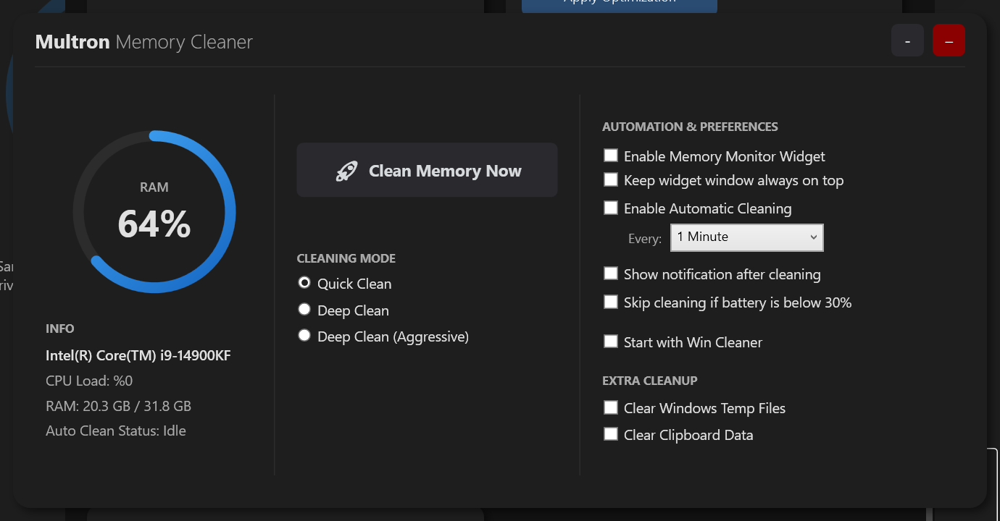
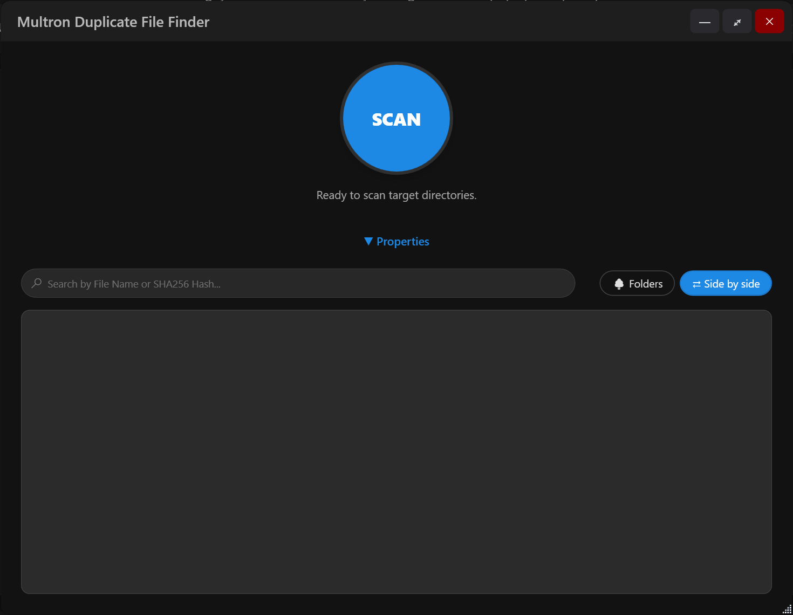
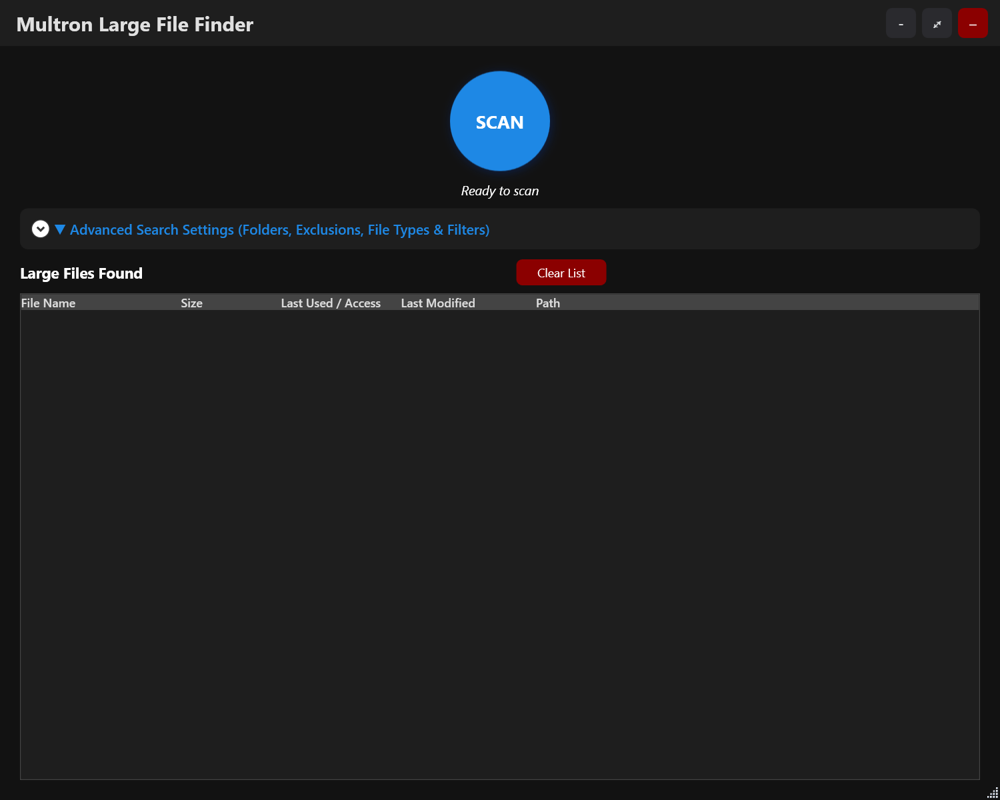

<div align="center">

  

  # Multron Win Cleaner

  **Modern, lightweight, and community-driven Windows system optimizer.**  
  Completely free, open-source, and free of subscriptions, paywalls, or background telemetry.

  <p align="center">
    <a href="https://github.com/winball501/MultronWcleaner/releases">
      
    </a>
    
    
    <a href="https://github.com/winball501/MultronWcleaner-Database">
      
    </a>
    
    <a href="https://github.com/winball501/MultronWcleaner/actions/workflows/build.yml">
    
  </a>
  </p>

  [Download Release](https://github.com/winball501/MultronWcleaner/releases/latest) • [Database Repo](https://github.com/winball501/MultronWcleaner-Database) • [Report Issue](https://github.com/winball501/MultronWcleaner/issues) • [Support on Patreon](https://www.patreon.com/cw/multron)

</div>

> [!WARNING]
> **Antivirus false positives:** some antivirus programs may flag Multron Win Cleaner or one of its DLL files as suspicious when you download or run it. In particular, **Bitdefender** and engines that use it (for example Emsisoft, eScan, GData, Arcabit, VIPRE) may detect `MultronWinCleaner.dll` **heuristically as ransomware**, with a name such as `Gen:Heur.Ransom.Imps.3`. This is a false positive: a heuristic detection is based on behavior, not on a known malware signature, and it is triggered by what a system cleaner has to do (closing programs, deleting files, changing Windows settings). Multron Win Cleaner does not encrypt files, does not ask for a ransom and does not send your data anywhere except the optional cloud malware scan. The file has been reported to Bitdefender as a false positive again. The full source code is in this repository, and every release is built automatically by GitHub Actions. If your antivirus blocks the app, you can report the file to its vendor as a false positive or add an exception for the app folder.
>
> * Bitdefender false positive form: <https://www.bitdefender.com/consumer/support/answer/29358/>
> * Microsoft Defender file submission: <https://www.microsoft.com/en-us/wdsi/filesubmission>

---

## Previews

<div align="center">
  
</div>

<table>
  <tr>
    <td align="center"><br/><b>Light mode</b></td>
    <td align="center"><br/><b>Malware Scan</b></td>
  </tr>
  <tr>
    <td align="center"><br/><b>Utilities</b></td>
    <td align="center"><br/><b>Settings</b></td>
  </tr>
  <tr>
    <td align="center"><br/><b>Startup Manager</b></td>
    <td align="center"><br/><b>Memory Cleaner</b></td>
  </tr>
  <tr>
    <td align="center"><br/><b>Duplicate File Finder</b></td>
    <td align="center"><br/><b>Large File Finder</b></td>
  </tr>
</table>

---

## Overview

**Multron Win Cleaner** is a comprehensive system maintenance, security and disk recovery suite engineered for Windows. Unlike conventional cleaning tools, it pairs deep low-level system controls (DISM, SFC, WinSxS, boot-time operations) with transparent, community-updatable cleaning definitions — and one scan checks junk files, system health, firewall rules, shortcuts, security settings and duplicate files together.

The application is fully localized into **12 languages**: English, Turkish, German, Spanish, French, Italian, Brazilian Portuguese, Russian, Japanese, Korean, Simplified Chinese, and Traditional Chinese.

---

## Key Features

### 🧹 Deep System Cleanup
* **Application Rules:** Continuously updated definitions for third-party software, browser caches, and temporary data.
* **Modular Rule Database:** Cleanup targets are governed by a modular [`database.txt`](https://github.com/winball501/MultronWcleaner-Database) repository, allowing instant community contributions without altering core application binaries.
* **Deep Log Tracing:** Configurable detection and wiping of `.log`, `.etl`, `.dmp`, `.tmp`, and `.bak` files across target directories.
* **Age-Based File Filters:** Target files strictly older than defined day thresholds based on file creation or last access timestamps.
* **Exceptions:** Exclude files and whole folders from scanning and cleaning.
* **Saved Selections:** Your ticked locations and commands are remembered, with a one-click **Reset Selections** button.
* **Native cleanmgr Access:** Windows Disk Cleanup presets run silently in the background during automatic cleaning.

### 🩺 System Health (DISM & SFC)
* **No Command Windows:** DISM and SFC run inside the app with live progress.
* **Result Panels:** Component store analysis, component store health and system file checks are shown as color-coded panels (green when healthy) with clear explanations.
* **Repair on Demand:** Tick **Run during cleaning** on a panel to clean up the component store (WinSxS), repair the Windows image (`/RestoreHealth`) or repair system files (`sfc /scannow`) as part of the clean.

### 🛡️ Security Check
* **Finds Insecure Windows Settings:** Checks more than 50 settings that weaken your PC — UAC or Windows Firewall turned off, no active antivirus, Defender disabled by policy or with whole drives excluded, SmartScreen off, **AutoPlay on for USB drives**, AutoRun, SMB 1.0, Remote Desktop without Network Level Authentication, disabled Windows Update, Guest account on, blocked Task Manager, sign-in screen backdoors, Office running all macros and more.
* **Risk Levels:** Every finding is marked HIGH, MEDIUM or LOW with an explanation of why it matters.
* **One-Click Fix & Undo:** Tick the findings and click **Fix Selected**. Previous values are backed up first, so every fix can be undone.
* Available in Utilities and as an option of the main scan, with a notification when an automatic scan finds high-risk settings.

### 🔎 One Scan, Every Check
* After the folder scan, **Firewall Rules**, **Shortcuts**, **Security Settings** and **Duplicate Files** run as steps of the scan, each with its own result panel above the scan results (green when nothing was found).
* While a step runs, the Clean button turns into **Cancel**, the progress is shown on the main screen, **Show Status** opens the tool, and **✕** skips the step.
* Nothing is changed automatically — remove rules, fix shortcuts, fix settings or review duplicates right from the panels.

### ⏰ Automatic Cleaning
* **Flexible Schedules:** Every X minutes, daily, weekly or custom days, with an allowed time range and optional **weeks of the month**.
* **Run Conditions:** Waits when the CPU is busy or the PC is in use, and never interrupts a scan or clean you started yourself.
* **Startup Cleaning:** Scan or scan and clean when Windows starts.
* **Status at a Glance:** Green status lines on the main window show when automatic or startup cleaning is on and when the next run is.
* **Notifications:** Bottom-right notifications for finished automatic runs, duplicate files and security warnings.

### 🛡️ Malware Scanner & Quarantine

> [!NOTE]
> **Test release:** the cloud malware scan is published for testing. It is released so it can be tried thoroughly and made stable, so results and behavior may still change. Please report false detections, missed threats or any problems in [Issues](https://github.com/winball501/MultronWcleaner/issues).

* **Cloud Engine:** Files are checked in the cloud by the [viruskov.com](https://viruskov.com) OPEN-EDR engine over an encrypted TLS connection. The scan servers run on a VDS hosted by [Türkbil](https://turkbil.net.tr/).
* **Quick, Full and Custom Scans:** Scan running processes, startup items and the folders you choose, or let a malware scan run automatically after the main system scan.
* **Privacy First:** By default only executables and scripts (`.exe`, `.dll`, `.ps1`, `.bat`...) are sent; personal files such as photos and documents are never uploaded while this filter is on. Folder paths are sent with your user folders replaced by placeholders such as `%USERPROFILE%\Downloads`, so no Windows user name leaves your PC. A license agreement explains exactly what is sent before the first cloud scan; you can also read it here: [Cloud Malware Scan License Agreement](MALWARE_SCAN_EULA.md).
* **Hash First, Compressed Uploads:** Files the server already knows are answered by their SHA-256 without uploading them; the others are compressed before upload when that saves space.
* **Rescan and "Possibly Clean":** Any result can be scanned again without the server's saved verdict. Files almost identical to a verified clean file are marked "Possibly clean".
* **Reconnects by Itself:** If the connection drops, for example while the server restarts, the scan waits and reconnects instead of failing.
* **Right-Click Scanning:** Optional *Scan with Multron Malware Scan* entry in the File Explorer right-click menu for files, folders and drives, plus *Send To > Multron Malware Scan* for scanning several items at once. Works while the app runs in the background.
* **Quarantine Manager:** Suspicious or user-selected files can be safely isolated into a local quarantine vault with full metadata (origin path, SHA-256, size, threat label, timestamp).
* **Restore / Delete:** Quarantined files can be restored to their original location at any time, deleted individually, or purged in bulk.
* **You Decide What Is Removed:** When a clean finds malicious files from the last scan, it lists them and asks before deleting anything. Automatic and startup cleans never delete them.
* **Remove All Threats:** A single button deletes every remaining threat at once (after a confirmation that lists them), or clean each one by hand. Deleting or quarantining force-closes any program started from the infected file and the programs it started, while Windows system processes are never touched.
* **Removal History:** A quarantined or deleted file stays in the results marked "Deleted by user" / "Quarantined by user" with the time; double-click a row for the full details, threat name, SHA-256 and the steps taken.
* **Offline Mode:** Turns off every online feature, including the cloud scan, when you do not want the app to connect to the internet.

### 🔒 Locked File & Process Management
* **Real-Time Lock Detection:** Surfaces file locks dynamically, displaying the active locking Process Name, Process ID (PID), and absolute file path.
* **Force Unlock & Delete:** Kills only the processes that hold the file (system processes are protected) and retries the deletion.
* **Boot Operations Manager:** Schedules pending file removal and modification routines to execute cleanly during the next Windows reboot cycle.

### ⚙️ System & Startup Control
* **Startup Manager:** Inspects and toggles boot entries across Registry keys, Task Scheduler, and Winlogon Userinit targets.
* **Startup Sentinel:** Delivers real-time notifications whenever a newly installed application registers a boot entry.
* **Firewall Rule Cleaner:** Scans for and removes broken Windows Firewall rules that point to programs that no longer exist.
* **Shortcut Fixer:** Finds Desktop and Start Menu shortcuts to missing programs, repairs the ones whose program moved to a new version folder and moves the others to the Recycle Bin.
* **System Optimization:** Two profiles — **For old systems** pauses selected services, **For new systems** applies performance settings (power plan, Game Mode, priorities, faster menus and more). Settings are re-applied at startup, every action is listed in an Activity log, and **Undo** restores your previous values.

### 🔔 Background Scans & Notifications
* **Startup and Scheduled Scans:** The app can start with Windows in the system tray (without a UAC prompt) and scan or clean automatically.
* **Findings Reported After the Scan:** Insecure Windows settings, broken firewall rules, broken shortcuts, duplicate files and malware scan results are listed above the scan results. Nothing is changed until you confirm.
* **Actionable Notifications:** After a background scan, a notification tells you what was found, with a button that opens the details. Problems are shown with a red warning sign.
* **Your Choice:** Each kind of notification can be turned on or off, and notifications can appear in any corner of the screen, lined up or stacked on top of each other.

### 🎨 Comfort
* **Windows Theme:** Opens in dark mode when Windows uses dark mode and in light mode otherwise, and switches along with Windows. Choosing a theme by hand keeps your choice.
* **Transparency Effects:** Optional see-through windows with a tint color (blue, green, orange, purple, red, pink, teal or gray) and strength of your choice.
* **Quick Search:** The main screen, Duplicate File Finder and Startup Manager share the same search box: type to filter, press Esc or ✕ to clear.
* **Consistent Look:** Themed message windows with a colored icon that fits each message (also in dark mode), matching scroll bars in every window, and windows that always fit on the screen.
* **Automatic Saving:** Settings are saved as soon as you change them; there is no Save button. The Settings window can be resized, maximized and reset to defaults.
* **Updates Built In:** The app and the cleaning database can check for updates in the background, at an interval you choose, or on demand from Settings > App Updates. The app updates itself without a separate updater: it swaps its own files, restarts and puts the old files back if anything fails. Your settings are never overwritten, and update packages that would write outside their own folder are refused.
* **One Copy at a Time:** Starting the app again, or scanning from the right-click menu, uses the copy that is already running instead of opening a second one.
* **12 Languages:** The language can be changed at any time in Settings.

### 📊 Memory & Performance Tracking
* **RAM Optimizer:** Manual or interval-based memory working set reductions.
* **Real-Time Resource Monitor:** Continuous visual tracking for active CPU and memory utilization.

### 🔍 Storage Utilities
* **Duplicate File Finder:** Byte-by-byte verified, A **side-by-side view** shows each copy next to its original, 40 quick-select file types and presets for images, videos, music, documents, archives and installers, and a safe delete that always keeps one copy.
* **Large File Finder:** Scans drive structures to isolate oversized media, archives, installers, disk images and virtual machines, backups, dumps and logs.
* **Pre-Deletion Audit:** Comprehensive summary table displaying each file's size, creation date, modification date, and age in days prior to execution.

---

## System Requirements

* **OS:** Windows 10 / Windows 11 (64-bit)
* **Privileges:** Administrator permissions (required for DISM operations, boot-time actions, and Registry access). Because of this, starting the app, including from the right-click menu, shows a UAC prompt; starting with Windows does not.
* **Runtime:** [.NET 8 Desktop Runtime](https://dotnet.microsoft.com/download/dotnet/8.0)

---

## Installation

1. Navigate to the [Releases](https://github.com/winball501/MultronWcleaner/releases) section.
2. Download one of these:
   * `mwc_setup.exe` installs the app for your user in `%LOCALAPPDATA%\Programs\Multron Win Cleaner` (no administrator rights needed for setup) and updates an existing installation in place.
   * `mwc.zip` is the portable version: extract it anywhere and run `MultronWinCleaner.exe` from the `mwc` folder.
3. Start the app and confirm the UAC prompt. Later updates can be installed from Settings > App Updates.

---

## Cloud Malware Scan Protocol (v3, hash first)

How Multron Win Cleaner talks to the viruskov.com OPEN-EDR scan server.

- Client: `MultronWinCleaner/Processes/CloudScanClient.cs`
- Server: `multron_server.exe` (Rust, source in `HydraDragonAntivirus/OpenEDR/multron_server_rs`), run from the `OpenMalwareScannerPortable` folder next to the engine rules.

### Transport

- WebSocket (RFC 6455). In production the client connects to `wss://api.viruskov.com/ws` through a Cloudflare Tunnel: Cloudflare terminates TLS and the tunnel forwards plain `ws://` to the server (default port `5306`, path `/ws`).
- The URL is compiled into the client (`CloudScanClient.ServerUrl`). Unencrypted `ws://` is accepted only for a server on the same PC (localhost).
- `CloudScanClient.ServerCertSha256` is only for a direct `wss://` connection to a server with a self-signed certificate; leave it empty behind Cloudflare.
- One connection is reused for all files of a scan session. Keep-alive frames are sent every 20 s.

### Flow

1. The client hashes every file (streamed, the file is not loaded into memory).
2. Hashes go to the server in `check` batches (up to `checkBatch` items per message).
3. The server answers each hash from what it already knows, without the file:
   - its **verdict cache**: every file any client ever uploaded (shared by all clients, kept on disk in `multron_cache.jsonl`; clean/malicious verdicts 14 days, unknown 24 hours);
   - **hash signatures** (`malicious_sha256.txt`, EICAR); a malicious hit wins over everything;
   - the engine's **SHA-256 whitelist** (`xorfilter_rules/benign_sha256.xf`);
   - a file **another client is uploading right now**; the answer is sent when that scan ends.
4. Only files answered with `need_upload` are read and uploaded with `scan`.

### Messages

Every control message is one WebSocket **text** message containing JSON (max 1 MiB). File contents are sent as one or more WebSocket **binary** messages.

**Handshake**

```
C → S  {"type":"hello","version":3,"client":"MultronWinCleaner","token":"<optional>"}
S → C  {"type":"hello_ok","version":3,"engine":"OpenEDR static","pipeline":4,"checkBatch":512,"maxMB":100,"encodings":["br"]}
       or {"type":"error","message":"..."}   (server closes)
```

The server accepts version 2 clients (no `check`, every file goes through `scan`).

**Hash check**

```
C → S  {"type":"check","items":[{"id":1,"name":"a.exe","size":123456,"sha256":"<64 hex>","folder":"%USERPROFILE%\\Downloads"}, ...]}
S → C  {"type":"result","id":1, ...}         known file: done, nothing is uploaded
S → C  {"type":"need_upload","id":2}         unknown: upload it with scan
S → C  {"type":"error","id":3,"message":"..."}
```

`folder` is the file's folder with the user profile and other well-known folders replaced by placeholders such as `%USERPROFILE%`, so no Windows user name is sent. `"rescan":true` asks for a fresh scan that skips the verdict cache.

**Upload**

```
C → S  {"type":"scan","id":2,"name":"b.dll","size":5000,"sha256":"<64 hex>","folder":"..."}
S → C  {"type":"send_file","id":2}          (or a result right away if it became known meanwhile)
C → S  exactly <size> bytes, split into binary messages (256 KiB chunks)
S → C  {"type":"result","id":2, ...}        when the engine is done
```

- When the server lists `"br"` in `encodings`, the client may Brotli-compress an upload that gets at least 10% smaller and adds `"encoding":"br","csize":<compressed size>` to `scan`.
- After `send_file`, the next binary bytes belong to that id; the client finishes the upload before sending anything else. Checks wait while an upload is being sent.
- The client keeps at most `pipeline` uploads unanswered; the server holds the connection's reader until a slot is free, so more would block hash checks too.
- The server verifies the SHA-256 of the received bytes.
- An error for one file comes as `{"type":"error","id":N,...}` and the connection stays usable. An `error` without `id` ends the connection.

**Result message**

```json
{
  "type": "result",
  "id": 1,
  "verdict": "clean | possible_clean | malicious | suspicious | unknown",
  "threat": "Win.Trojan.Example",
  "detail": "Win.Trojan.Example (ClamAV)",
  "score": 1.0,
  "sha256": "...",
  "scan_ms": 810,
  "source": "scan | cache | whitelist | hash | shared"
}
```

### Server side

- Engine work runs on its own thread pool (`--workers`, default CPU cores − 1). Clients take turns (round-robin), so one client with 100k files does not hold back the others.
- A panic in the engine fails only that file: it is reported `suspicious` (`Unscannable.EngineCrash`) and remembered, so it is never scanned again.
- Files the engine cannot classify (`unknown`) and detected threats are kept in the work folder as `<SHA256>_<name>` for review, each within its own disk quota; clean files are kept only when that is turned on.
- Limits: `--max-conns` (2048), `--max-per-ip` (8, real IP from `CF-Connecting-IP` behind the tunnel), `--token`, `--max-mb` (100, hard ceiling: a larger value is clamped to 100), `--max-inflight-mb` (768).
- Flood protection: one WebSocket message is at most 1 MiB (uploads come in 256 KiB chunks); per IP 120 new connections/min and 2048 MB uploaded/hour; per connection 100 messages/s and 3000 hash checks/s. Breaking a limit (or a bad token, invalid JSON, wrong hash, oversized upload) is a strike; 15 strikes block the IP for 15 minutes (HTTP 429 before the WebSocket upgrade).

### Timeouts and reconnecting

| Side | What | Limit |
|---|---|---|
| Client | connect + handshake | 15 s |
| Client | waiting for a check answer / `send_file` / `result` | 10 min |
| Server | idle connection | 30 min |
| Server | gap between two upload chunks | 2 min |

If the connection drops during a scan, the client reconnects one attempt at a time for all scan workers, waiting 2, 4, 8, 15 and then 30 s between failed attempts. A file is tried at most 3 times. If the server cannot be reached for 4 minutes, or it rejects the connection (bad token, old protocol, blocked IP), the scan stops with an error. A rescan can be stopped at any time.

### What the client sends

- Quick and Full scans send only executables and scripts. Custom scans send other files only if the user turns off "Only executables & scripts".
- Files larger than the user's limit (default 50 MB) are skipped. The server refuses files above its own `--max-mb` limit.

---

## Community Database Contributions

The cleaning rules are kept outside the main codebase to allow rapid additions without needing a new version release. You can inspect or extend the rule definitions directly at the [MultronWcleaner-Database](https://github.com/winball501/MultronWcleaner-Database) repository.

Pull Requests adding support for new applications or custom directory paths are always reviewed and merged there.

---

## Support the Project

Multron Win Cleaner is free, open-source and has no ads, subscriptions or locked features. If it helps you and you would like to support its development, you can do so on Patreon:

<a href="https://www.patreon.com/cw/multron"></a>

Every bit of support is appreciated, but the app stays completely free either way.

---

## License

This project is licensed under the **MIT License**. See the [LICENSE](LICENSE) file for complete details.
